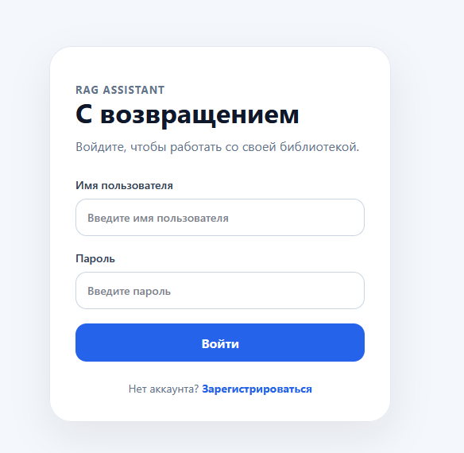
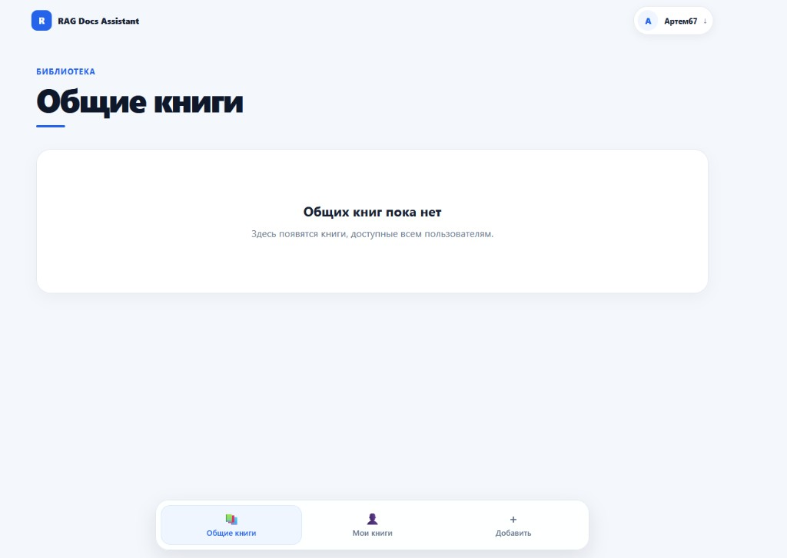
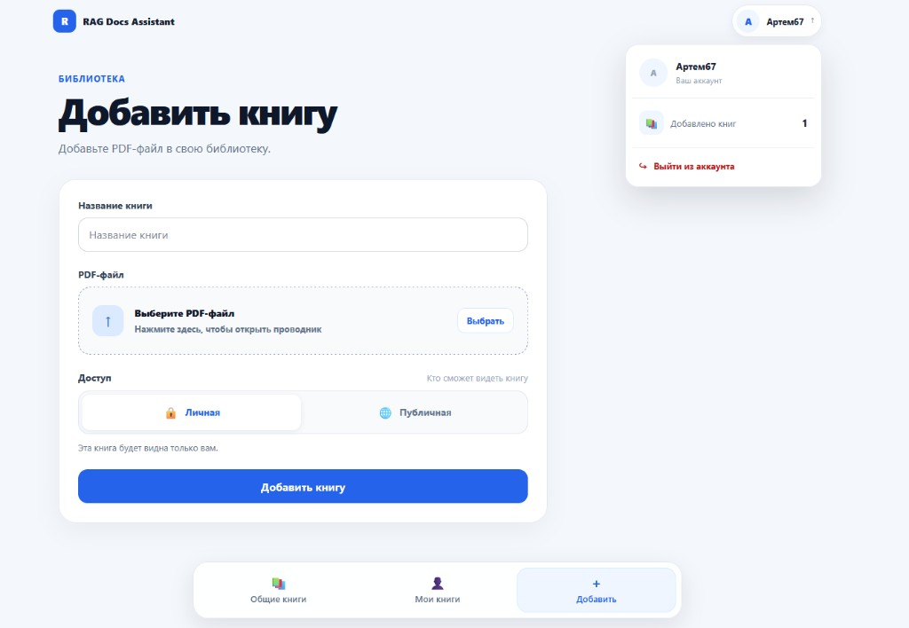
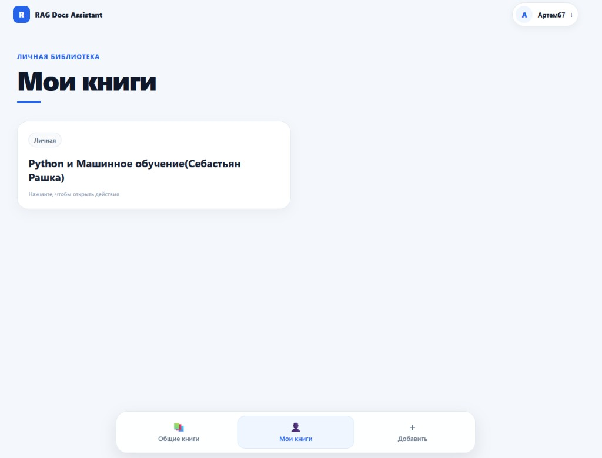
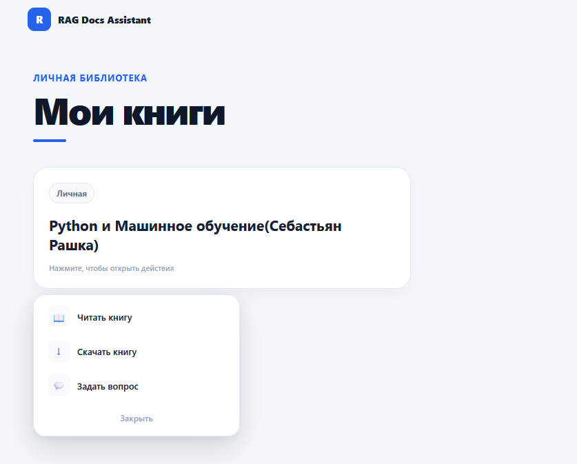
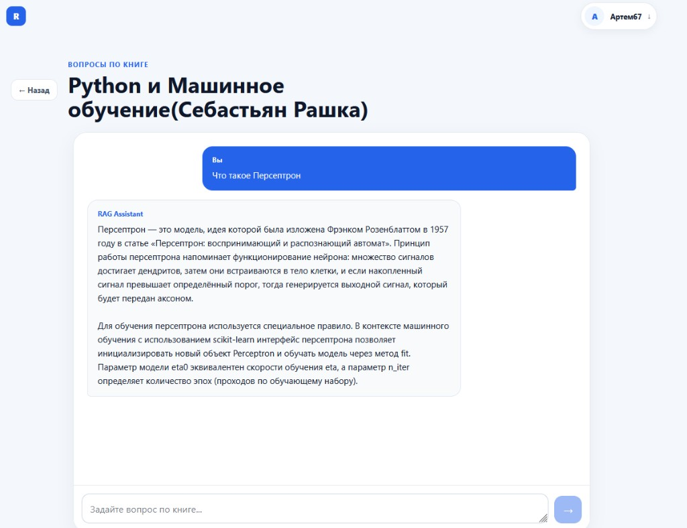

# 📚 RAG-ассистент по книгам (`rag_docs_assistant`)

Веб-приложение, которое превращает учебные материалы в персонального ассистента: студент загружает PDF (учебник, конспект, слайды лекций), система индексирует текст в векторной базе и отвечает на вопросы по содержимому с помощью **YandexGPT**. 

---

## 🎯 Зачем этот сервис

Идея проекта — помочь студентам **готовиться к сессии**, разбираться в учебниках и новых технологиях, не перечитывая каждый раз десятки страниц.

Типичный сценарий такой:

1. Студент изучает тему по книге или ходит на лекции.
2. Материалы (учебник, PDF-записи лекций, методички) загружаются в сервис и становятся частью личной или общей библиотеки.
3. Когда нужно **повторить** или закрыть пробел перед экзаменом, достаточно задать вопрос своими словами — например: *«Что такое переобучение?»* по книге по машинному обучению.
4. Ассистент находит релевантные фрагменты именно в загруженном материале и объясняет понятие подробно, опираясь на этот текст, а не на общие знания из интернета.

Так сервис работает и как **читалка с чатом по книге**, и как **репетитор перед сессией**: можно скинуть конспекты за семестр и прогонять по ним вопросы, термины и формулировки, которые могут попасться на зачёте.


---

## 🖥 Интерфейс

**Вход** — доступ к своей библиотеке



**Общие книги** — материалы, которыми поделились другие



**Добавить книгу** — PDF учебника или конспекта, личный или публичный доступ



**Мои книги** — загруженные материалы студента



**Действия** — читать, скачать или задать вопрос



**Чат** — повторение темы перед сессией



---

## ⚙️ Логика работы приложения

1. **Регистрация и вход:**  
   Пользователь создаёт аккаунт (`POST /auth/register`). Пароль хешируется через `bcrypt` (`passlib`) и сохраняется в SQLite. При входе (`POST /auth/login`) проверяются учётные данные и выдаётся **JWT**-токен. Дальнейшие запросы к API выполняются с заголовком `Authorization: Bearer <token>`.

2. **Загрузка книги:**  
   Авторизованный пользователь отправляет PDF, название и флаг доступа (`личная` / `публичная`) на `POST /book/upload`. Файл сохраняется в `data/book/`, в таблицу `books` добавляется запись с привязкой к владельцу.

3. **Предобработка и индексация:**  
   Модуль `src/ml/auxiliary/all_processing.py` запускает полный пайплайн:
   - PDF читается через `PyPDFLoader` (LangChain);
   - текст делится на чанки размером **600** символов с перекрытием **50** (`RecursiveCharacterTextSplitter`);
   - по первым пяти чанкам извлекаются именованные сущности (**NER**) моделью `babelscape/wikineural-multilingual-ner` — в теги попадают сущности с уверенностью ≥ **0.8**;
   - чанки превращаются в эмбеддинги моделью `sentence-transformers/paraphrase-multilingual-MiniLM-L12-v2` и сохраняются в отдельную коллекцию **ChromaDB**: `vector_db/book_{id}`.

4. **Доступ к книгам:**  
   - **Общая библиотека** (`GET /books/all`) — все книги с `is_public=True`;
   - **Мои книги** (`GET /books/my`) — только книги текущего пользователя;  
   Чтение (`GET /book/{id}/read`) и скачивание (`GET /book/{id}/download`) доступны, если книга публичная **или** принадлежит текущему пользователю. Иначе API возвращает `403`.

5. **Вопрос по книге (RAG):**  
   Пользователь задаёт вопрос в чате (`POST /chat/ask`). Система:
   - проверяет право доступа к книге;
   - ищет **k = 3** ближайших чанка в ChromaDB по косинусной/метрике схожести эмбеддингов;
   - собирает промпт в `src/services/templates/prompt.py` (контекст + вопрос);
   - отправляет запрос в **YandexGPT** (`temperature=0.2`, `max_tokens=1000`) и возвращает развёрнутый ответ, опирающийся на найденные фрагменты.

6. **Веб-интерфейс:**  
   React-приложение (Vite) на порту **5173** общается с FastAPI на **8000**. После входа доступны страницы общей библиотеки, личных книг, загрузки PDF и чата по выбранной книге.

---

## 🛠 Стек технологий

* **Язык (backend):** Python
* **API:** FastAPI, Uvicorn, Pydantic
* **База данных:** SQLite, SQLAlchemy
* **Авторизация:** JWT (`python-jose`), bcrypt (`passlib`)
* **RAG / ML:** LangChain, ChromaDB, Sentence-Transformers, Hugging Face Transformers (NER), PyPDF
* **LLM:** Yandex AI Studio SDK (YandexGPT)
* **Frontend:** React 19, TypeScript, React Router, Vite
* **Инструменты:** python-dotenv

---

## 📁 Структура проекта

```text
project/
│
├── data/
│   ├── book/                   # Загруженные PDF (создаются при upload)
│   └── database/
│       └── database.db         # SQLite (создаётся при старте API)
│
├── vector_db/                  # Векторные базы ChromaDB
│   └── book_{id}/              # Отдельный индекс на каждую книгу
│
├── src/
│   ├── backend/                # HTTP API
│   │   ├── api.py              # FastAPI-приложение, CORS, роутеры
│   │   ├── database.py         # Подключение к SQLite
│   │   ├── jwt.py              # Создание и проверка JWT
│   │   ├── security.py         # Хеширование и проверка паролей
│   │   ├── models/
│   │   │   ├── model.py        # Pydantic-схемы запросов
│   │   │   └── model_base.py   # ORM-модели User и Book
│   │   └── routers/
│   │       ├── register.py     # POST /auth/register
│   │       ├── login.py        # POST /auth/login
│   │       ├── upload_book.py  # POST /book/upload
│   │       ├── all_books.py    # GET /books/all
│   │       ├── my_books.py     # GET /books/my
│   │       ├── book.py         # GET /book/{id}/read и /download
│   │       └── chat.py         # POST /chat/ask
│   │
│   ├── ml/                     # RAG-пайплайн
│   │   ├── auxiliary/
│   │   │   ├── loader.py       # Загрузка PDF и нарезка на чанки
│   │   │   └── all_processing.py
│   │   ├── rag/
│   │   │   ├── ingest.py       # Создание эмбеддингов и ChromaDB
│   │   │   └── vector_search.py
│   │   └── NER/
│   │       └── ner.py          # Извлечение тегов (NER)
│   │
│   ├── services/
│   │   ├── llm.py              # Вызов YandexGPT
│   │   └── templates/
│   │       └── prompt.py       # Промпт для RAG
│   │
│   ├── frontend/               # React + Vite + TypeScript
│   │   ├── src/
│   │   │   ├── app/            # Корневой App и маршруты
│   │   │   ├── pages/          # Страницы UI
│   │   │   ├── components/     # Шапка, карточки книг, навигация
│   │   │   ├── features/       # Auth, API книг и чата
│   │   │   └── shared/         # HTTP-клиент
│   │   ├── package.json
│   │   └── vite.config.ts
│   │
│   └── config.py               # Переменные окружения
│
├── docs/
│   └── screenshots/            # Скриншоты интерфейса для README
├── tests/                      # Заготовка для автотестов
├── .env.example                # Пример конфигурации
├── .gitignore
├── main.py                     # Точка входа backend (Uvicorn)
├── README.md
└── requirements.txt            # Python-зависимости
```

---

## 🚀 Установка и запуск

### 1. Клонирование репозитория

```bash
git clone https://github.com/ArtemKutlaev/rag_docs_assistant.git
cd rag_docs_assistant
```

### 2. Создание и активация виртуального окружения

```bash
python -m venv venv
```

* **Windows (PowerShell):**
  ```bash
  .\venv\Scripts\Activate
  ```
* **macOS / Linux:**
  ```bash
  source venv/bin/activate
  ```

### 3. Установка зависимостей backend

```bash
pip install -r requirements.txt
```

При первом запуске Hugging Face скачает модели эмбеддингов и NER — это может занять время и потребует доступа в интернет.

### 4. Настройка конфигурации (`.env`)

Создайте файл `.env` на основе `.env.example` и заполните значения.

### 5. Запуск backend

Из **корня** проекта:

```bash
python main.py
```

API поднимается на [http://127.0.0.1:8000](http://127.0.0.1:8000) с автоперезагрузкой.  
Документация FastAPI: [http://127.0.0.1:8000/docs](http://127.0.0.1:8000/docs).

При старте автоматически создаются таблицы SQLite в `data/database/database.db`.

### 6. Установка и запуск frontend

В отдельном терминале:

```bash
cd src/frontend
npm install
npm run dev
```

Vite по умолчанию открывает интерфейс на [http://localhost:5173](http://localhost:5173). CORS на backend разрешает origin `http://localhost:5173` и `http://127.0.0.1:5173`.

### 7. Как пользоваться

1. Зарегистрируйтесь и войдите.
2. На странице **«Добавить книгу»** загрузите PDF учебника, конспекта или записей лекций. Укажите название и доступ (личная / публичная) и дождитесь индексации.
3. В **общей библиотеке** или **моих книгах** откройте карточку: можно читать PDF, скачать файл или задать вопрос.
4. В чате сформулируйте вопрос по материалу — например, определение термина перед зачётом. Ответ строится только на найденных фрагментах загруженного файла.

---

## 🔌 Основные эндпоинты API

| Метод | Путь | Описание |
| --- | --- | --- |
| `POST` | `/auth/register` | Регистрация (`username`, `password`, `password_confirm`) |
| `POST` | `/auth/login` | Вход (OAuth2 form: `username`, `password`) → JWT |
| `POST` | `/book/upload` | Загрузка PDF, NER-теги, создание ChromaDB |
| `GET` | `/books/all` | Публичные книги |
| `GET` | `/books/my` | Книги текущего пользователя |
| `GET` | `/book/{book_id}/read` | Открыть PDF в браузере |
| `GET` | `/book/{book_id}/download` | Скачать PDF |
| `POST` | `/chat/ask` | RAG-вопрос (`query`, `book_id`) |

Все эндпоинты, кроме регистрации и входа, требуют JWT.

---

### Планы на ближайшее будущее.
 1. Добавление тестов pytest.
 2. Улучшение промпта в нейросеть и обработки вопроса пользователя, с учетом его предпочтений(краткий ответ/подробный)ю
 3. Добавить Docker
 4. Дописать логику обработки NER,которая будет находить в книгах ключевые данные(технологии/ученые/создатели/методы). Добавление фронтенда с отображением этой информации у каждой книги.
 5. Добавить поиск книг по названию/будущим тегам из 4 пункта.
 6. Добавить возможность объединения книг/файлов по группам, чтобы задавать вопросы не к отдельным книгам/файлам, а к группе сразу.
 7. Добавить Celery/Redis для очереди добавления/векторизации книг(нужно,если будет много пользователей).
 8. Добавление поддержки разных форматов, кроме PDF. Например .docx, .text. 
 9. Добавление модуль Computer Vision для обработки записей по фотографиям.
 